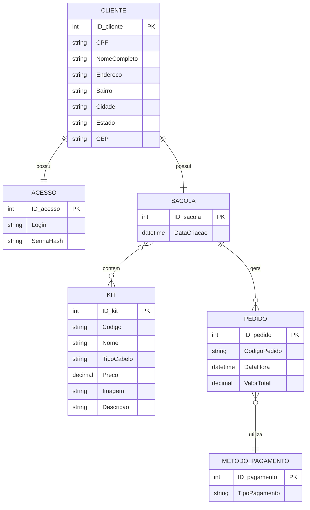
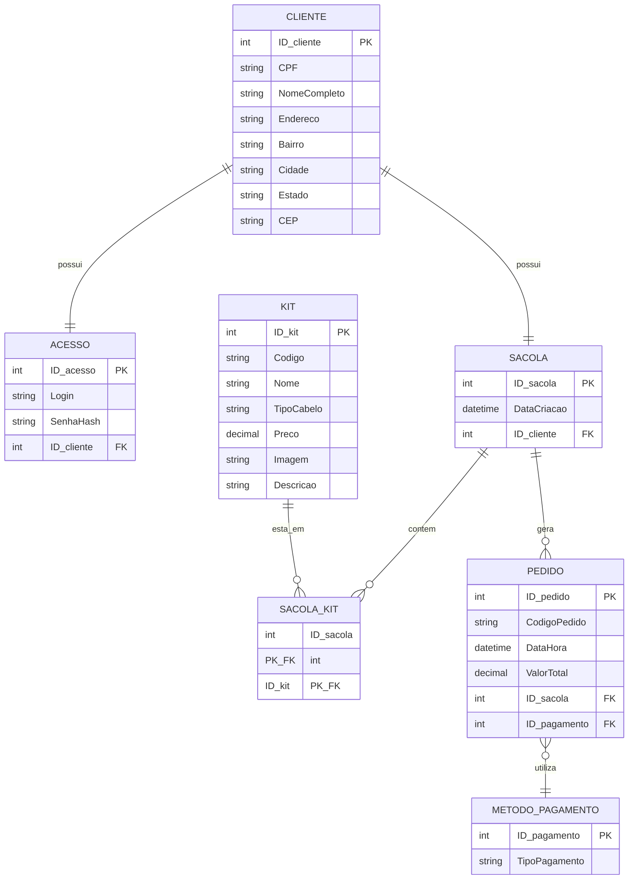

## Modelo Entidade-Relacionamento

### MER Conceitual

```mermaid
erDiagram
  CLIENTE ||--|| ACESSO : possui
  CLIENTE ||--|| SACOLA : possui
  SACOLA }o--o{ KIT : contem
  SACOLA ||--o{ PEDIDO : gera
  PEDIDO }o--|| METODO_PAGAMENTO : utiliza

  CLIENTE {
    int ID_cliente PK
    string CPF
    string NomeCompleto
    string Endereco
    string Bairro
    string Cidade
    string Estado
    string CEP
  }
  ACESSO {
    int ID_acesso PK
    string Login
    string SenhaHash
  }
  SACOLA {
    int ID_sacola PK
    datetime DataCriacao
  }
  KIT {
    int ID_kit PK
    string Codigo
    string Nome
    string TipoCabelo
    decimal Preco
    string Imagem
    string Descricao
  }
  PEDIDO {
    int ID_pedido PK
    string CodigoPedido
    datetime DataHora
    decimal ValorTotal
  }
  METODO_PAGAMENTO {
    int ID_pagamento PK
    string TipoPagamento
  }
```

### MER Lógico (com tabelas)

```mermaid
erDiagram
  CLIENTE ||--|| ACESSO : possui
  CLIENTE ||--|| SACOLA : possui
  SACOLA ||--o{ SACOLA_KIT : contem
  KIT ||--o{ SACOLA_KIT : esta_em
  SACOLA ||--o{ PEDIDO : gera
  PEDIDO }o--|| METODO_PAGAMENTO : utiliza

  CLIENTE {
    int ID_cliente PK
    string CPF
    string NomeCompleto
    string Endereco
    string Bairro
    string Cidade
    string Estado
    string CEP
  }
  ACESSO {
    int ID_acesso PK
    string Login
    string SenhaHash
    int ID_cliente FK
  }
  SACOLA {
    int ID_sacola PK
    datetime DataCriacao
    int ID_cliente FK
  }
  KIT {
    int ID_kit PK
    string Codigo
    string Nome
    string TipoCabelo
    decimal Preco
    string Imagem
    string Descricao
  }
  SACOLA_KIT {
    int ID_sacola PK_FK
    int ID_kit PK_FK
  }
  PEDIDO {
    int ID_pedido PK
    string CodigoPedido
    datetime DataHora
    decimal ValorTotal
    int ID_sacola FK
    int ID_pagamento FK
  }
  METODO_PAGAMENTO {
    int ID_pagamento PK
    string TipoPagamento
  }
```
